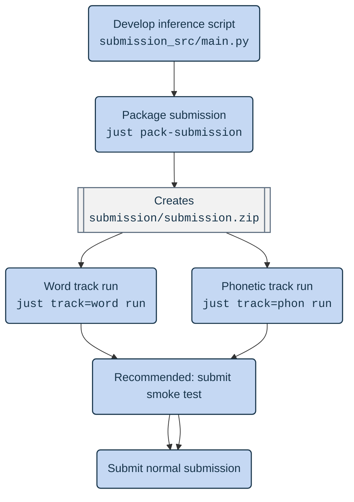

# On Top of Pasketti: Children’s Speech Recognition Challenge Runtime

 [![DrivenData Children's Speech Recognition Challenge](https://img.shields.io/badge/DrivenData-Children%E2%80%99s%20Speech%20Recognition%20Challenge-white?logo=data:image/png;base64,iVBORw0KGgoAAAANSUhEUgAAABAAAAAQCAYAAAAf8/9hAAAABGdBTUEAALGPC/xhBQAABBlpQ0NQa0NHQ29sb3JTcGFjZUdlbmVyaWNSR0IAADiNjVVdaBxVFD67c2cjJM5TbDSFdKg/DSUNk1Y0obS6f93dNm6WSTbaIuhk9u7OmMnOODO7/aFPRVB8MeqbFMS/t4AgKPUP2z60L5UKJdrUICg+tPiDUOiLpuuZOzOZabqx3mXufPOd75577rln7wXouapYlpEUARaari0XMuJzh4+IPSuQhIegFwahV1EdK12pTAI2Twt3tVvfQ8J7X9nV3f6frbdGHRUgcR9is+aoC4iPAfCnVct2AXr6kR8/6loe9mLotzFAxC96uOFj18NzPn6NaWbkLOLTiAVVU2qIlxCPzMX4Rgz7MbDWX6BNauuq6OWiYpt13aCxcO9h/p9twWiF823Dp8+Znz6E72Fc+ys1JefhUcRLqpKfRvwI4mttfbYc4NuWm5ERPwaQ3N6ar6YR70RcrNsHqr6fpK21iiF+54Q28yziLYjPN+fKU8HYq6qTxZzBdsS3NVry8jsEwIm6W5rxx3L7bVOe8ufl6jWay3t5RPz6vHlI9n1ynznt6Xzo84SWLQf8pZeUgxXEg4h/oUZB9ufi/rHcShADGWoa5Ul/LpKjDlsv411tpujPSwwXN9QfSxbr+oFSoP9Es4tygK9ZBqtRjI1P2i256uv5UcXOF3yffIU2q4F/vg2zCQUomDCHvQpNWAMRZChABt8W2Gipgw4GMhStFBmKX6FmFxvnwDzyOrSZzcG+wpT+yMhfg/m4zrQqZIc+ghayGvyOrBbTZfGrhVxjEz9+LDcCPyYZIBLZg89eMkn2kXEyASJ5ijxN9pMcshNk7/rYSmxFXjw31v28jDNSpptF3Tm0u6Bg/zMqTFxT16wsDraGI8sp+wVdvfzGX7Fc6Sw3UbbiGZ26V875X/nr/DL2K/xqpOB/5Ffxt3LHWsy7skzD7GxYc3dVGm0G4xbw0ZnFicUd83Hx5FcPRn6WyZnnr/RdPFlvLg5GrJcF+mr5VhlOjUSs9IP0h7QsvSd9KP3Gvc19yn3Nfc59wV0CkTvLneO+4S5wH3NfxvZq8xpa33sWeRi3Z+mWa6xKISNsFR4WcsI24VFhMvInDAhjQlHYgZat6/sWny+ePR0OYx/mp/tcvi5WAYn7sQL0Tf5VVVTpcJQpHVZvTTi+QROMJENkjJQ2VPe4V/OhIpVP5VJpEFM7UxOpsdRBD4ezpnagbQL7/B3VqW6yUurSY959AlnTOm7rDc0Vd0vSk2IarzYqlprq6IioGIbITI5oU4fabVobBe/e9I/0mzK7DxNbLkec+wzAvj/x7Psu4o60AJYcgIHHI24Yz8oH3gU484TastvBHZFIfAvg1Pfs9r/6Mnh+/dTp3MRzrOctgLU3O52/3+901j5A/6sAZ41/AaCffFUDXAvvAAAAIGNIUk0AAHomAACAhAAA+gAAAIDoAAB1MAAA6mAAADqYAAAXcJy6UTwAAABEZVhJZk1NACoAAAAIAAIBEgADAAAAAQABAACHaQAEAAAAAQAAACYAAAAAAAKgAgAEAAAAAQAAABCgAwAEAAAAAQAAABAAAAAA/iXkXAAAAVlpVFh0WE1MOmNvbS5hZG9iZS54bXAAAAAAADx4OnhtcG1ldGEgeG1sbnM6eD0iYWRvYmU6bnM6bWV0YS8iIHg6eG1wdGs9IlhNUCBDb3JlIDUuNC4wIj4KICAgPHJkZjpSREYgeG1sbnM6cmRmPSJodHRwOi8vd3d3LnczLm9yZy8xOTk5LzAyLzIyLXJkZi1zeW50YXgtbnMjIj4KICAgICAgPHJkZjpEZXNjcmlwdGlvbiByZGY6YWJvdXQ9IiIKICAgICAgICAgICAgeG1sbnM6dGlmZj0iaHR0cDovL25zLmFkb2JlLmNvbS90aWZmLzEuMC8iPgogICAgICAgICA8dGlmZjpPcmllbnRhdGlvbj4xPC90aWZmOk9yaWVudGF0aW9uPgogICAgICA8L3JkZjpEZXNjcmlwdGlvbj4KICAgPC9yZGY6UkRGPgo8L3g6eG1wbWV0YT4KTMInWQAAAGZJREFUOBFj/HdD5j8DBYCJAr1grSzzmDRINiNFbQ8jTBPFLoAZNHA04/O8g2THguQke0aKw4ClX5uw97vS7eGhjq6aYhegG0h/PuOfohCyYoGlbw04XCgOA8bwI7PIcgEssCh2AQDqYhG4FWqALwAAAABJRU5ErkJggg==)](https://kidsasr.drivendata.org/)

Welcome to the runtime repository for the [On Top of Pasketti: Children’s Speech Recognition Challenge](https://kidsasr.drivendata.org/) on DrivenData! This repository contains a few things:

1. **Runtime environment specification** ([`runtime/`](./runtime/)) — the definition of the environment where your code will run.
2. **Example submissions** ([`examples/`](./examples/)) — example submissions for both the Word and Phonetic tracks. Each will run successfully in the code execution runtime and output a valid submission.
3. **Metric code** ([`metrics/`](./metrics/)) — code to compute the evaluation metrics for both tracks.

You can use this repository to:

🔧 **Test your submission**: Test your submission using a locally running version of the competition runtime to discover errors before submitting to the competition website.

📦 **Request new packages in the official runtime**: Since your submission will not have general access to the internet, all dependencies must be pre-installed. If you want to use a package that is not in the runtime environment, make a pull request to this repository. Make sure to test out adding the new package to both official environments, CPU and GPU.

Changes to the repository are documented in [CHANGELOG.md](./CHANGELOG.md).

---

**[1. Runtime specification](#runtime-specification)**

**[2. Example submissions](#example-submissions)**

**[3. Testing a submission locally](#testing-a-submission-locally)**

- [Prerequisites](#prerequisites)
- [Data directory](#data-directory)
- [Code submission format](#code-submission-format)
- [Running your submission locally](#running-your-submission-locally)
- [Metric scoring code](#metric-scoring-code)
- [Running one of the example submissions](#running-one-of-the-example-submissions)
- [Smoke tests](#smoke-tests)
- [Runtime network access](#runtime-network-access)

**[4. Updating runtime dependencies](#updating-runtime-dependencies)**

---

## Runtime specification

The runtime specification can be found in the [`runtime/`](./runtime/) directory.

- Abstract Python dependencies are declared in [`pyproject.toml`](./runtime/pyproject.toml)
- The uv lockfile specifying the Python environment is at [`uv.lock`](./runtime/uv.lock)
- The test harness script is [`entrypoint.sh`](./runtime/entrypoint.sh). This is the what the container runs that calls your submitted code.
- The Docker image specification is given by [`Dockerfile`](./runtime/Dockerfile)

## Example submissions

This repository contains the following example submissions:

* Word Track
    * [`word/minimal`](./examples/word/minimal/) — a minimal example submission with a fake model (reads a hard-coded value from file and predicts it). You can use this as a template for your own submission.
    * [`word/parakeet`](./examples/word/parakeet/) — a more substantial example using NVIDIA's Parakeet TDT 0.6B V2. See the [README](./examples/word/parakeet/README.md) for more details.
* Phonetic Track
    * [`phonetic/minimal`](./examples/phonetic/minimal/) — a minimal example submission with a fake model (reads a hard-coded value from file and predicts it). You can use this as a template for your own submission.
    * [`phonetic/parakeet-cmudict`](./examples/phonetic/parakeet-cmudict/) — a more substantial example using NVIDIA's Parakeet TDT 0.6B V2 for automatic speech recognition and CMUdict for to transform to IPA. See the [README](./examples/phonetic/parakeet-cmudict/README.md) for more details.

## Testing a submission locally

When you make a submission on the DrivenData competition site, we run your submission inside a Docker container, a virtual operating system that allows for a consistent software environment across machines. **The best way to make sure your submission to the site will run is to first run it successfully in the container on your local machine.**

This is what a typical solution development flow looks like. You do all your work in `/submission_src/` and then package that up testing it locally, with smoke tests, and then doing a full run.



### Prerequisites

Using this repository requires the following:

- A local clone of the repository
- [Just](https://github.com/casey/just) (>=1.40.0) — a command runner to run various predefined tasks
- [Docker](https://docs.docker.com/get-docker/)
- At least 12 GB of free space for the Docker image

> [!TIP]
> This repository uses the [Just](https://github.com/casey/just) task runner. You use it on the command line with commands like `just pull`. You can run `just` by itself to see documentation for all available commands.

> [!NOTE]
> If you are installing Just on Ubuntu 24.04 LTS, we recommend installing with `snap` or with the [pre-built binaries](https://just.systems/man/en/pre-built-binaries.html). `apt install just` does not provide a recent enough version (>=1.40.0) for Ubuntu 24.04.

Additional requirements to test submissions with the GPU:

- [NVIDIA drivers](https://docs.nvidia.com/cuda/cuda-installation-guide-linux/index.html#package-manager-installation) with **CUDA 12**
- [NVIDIA container toolkit](https://docs.nvidia.com/datacenter/cloud-native/container-toolkit/latest/index.html)

### Data directory

In the official code execution platform, `/code_execution/data` will contain data provided for the test set. When testing your submission locally, we've provided a small demo sample of data formatted like the test data that will be used by default. You can find the demo data in [`data-demo`](./data-demo/) — one of the `data-demo/word` or `data-demo/phonetic` directories will be mounted into the container as `/code_execution/data`, depending on the active track. If you want to mount a different data directory, you can override this by setting the `KIDSASR_DATA_DIR` environment variable to an arbitrary directory path. This can be useful if, for example, you want to test your submission on a validation set that you've created from the training data. Be sure to match the expected directory structure documented on the challenge website.

> [!TIP]
> You can set the `KIDSASR_DATA_DIR` [environment variable](https://sna.cs.colostate.edu/software/environment-variables/) either with the `export` command or using a `.env` file. See [`.env.example`](./.env.example).

### Code submission format

Your final submission should be a ZIP archive named with the extension `.zip` (for example, `submission.zip`). The root level of the `submission.zip` file must contain a `main.py` which will be run by the container. For local testing, the justfile commands expect this file to be located at `submission/submission.zip` within this repository.

### Running your submission locally

This section provides instructions on how to run the your submission in the code execution container from your local machine. Key steps in the process have been defined as Just recipes in the [`justfile`](./justfile). Commands are run with `just {command_name}`. Some commands need you to specify a track, like `just track={track_name} {command_name}. For example, to test a submission for the Word track:

```sh
# Pull latest tag of official image
just pull

# Make a `submission.zip` file and put it at `submission/submission.zip`. Remember it must contain a `main.py` at the root.
# [Optional] Put your files in submission_src/ and use our convenience just recipe
just pack-submission

# Run the code execution test harness using your submission.
just track=word run
# OR
just track=phonetic run
```

> [!TIP]
> Some commands require specifying a track. If you want to avoid typing `track=...` every time, you can set an [environment variable](https://sna.cs.colostate.edu/software/environment-variables/) `KIDSASR_TRACK` instead. You can do that either with the `export` command or using a `.env` file. See [`.env.example`](./.env.example).

Run `just help` for more information about the available commands as well as information on the official and built images that are available locally.

Here's the process in a bit more detail:

1. First, make sure you have set up the [prerequisites](#prerequisites).
2. Download the official competition Docker image:

    ```sh
    just pull
    ```

3. Create a `submission.zip` file.
  - [Optional] You can move the files (code, model weights) you want to include your submission into the `submission_src` folder of the runtime repository. Then run:

    ```sh
    just pack-submission
    ```

    > [!IMPORTANT]
    > Note that the required `main.py` file should be in the archive root. Be careful if you're zipping up a folder that the contents are not nested inside the folder in the ZIP archive.
    >
    > - ✅ CORRECT — `main.py`
    > - ❌ INCORRECT — `my_submission/main.py`

4. Launch the test harness in a Docker container, and run the same inference process that will take place in the official runtime:

    ```sh
    just track=word run
    # OR
    just track=phonetic run
    ```

This runs the container [entrypoint](./runtime/entrypoint.sh) script. First, it unzips `submission/submission.zip` into `/code_execution/src/` in the container. Then, it runs the `main.py` script you've provided. In the local testing setting, the final submission is saved out to `submission/submission.jsonl` on your local machine. Logs will be printed out to console and saved to `submission/log.txt`.

> [!NOTE]
> If you're trying to test a local version of your runtime image that you've built with `just build`, you can use the `dev`-prefixed command `just dev-run` instead.


### Metric scoring code

We also provide a way to run the metric scoring code locally to evaluate your models. This implementation uses the same normalization as the competition so should produce similar scores. The code is in the `metric` directory: [`metric/score.py`](./metric/score.py).

You can run the scoring script with the path to your predictions and the path to the ground truth data. The script will automatically determine whether to calculate Word Error Rate (WER) or IPA Character Error Rate (CER) based on the contents of the ground truth file.

It can be run from the command line with `uv`, which will automatically set up the environment with the required dependencies::

```bash
uv run ./metric/score.py <path_to_predictions.jsonl> <path_to_ground_truth.jsonl>
```

You can also import the contents of `score.py` and use them in your own code. The methods and data we provide are:

| Name | Type | Description |
| :--- | :--- | :--- |
| `score_wer` | Function | Calculates Word Error Rate (WER) between predicted and actual sequences. Uses `english_spelling_normalizer`. |
| `score_ipa_cer` | Function | Calculates IPA Character Error Rate (CER) between predicted and actual IPA sequences. Normalizes IPA strings first. |
| `score_jsonl` | Function | Calculates WER or IPA-CER between predicted and actual transcriptions stored in JSONL files. |
| `normalize_ipa` | Function | Normalizes IPA strings: NFC normalization, removing tie bars/stress, decomposing nasals, etc. |
| `validate_ipa_characters` | Function | Checks if IPA string contains only characters in `VALID_IPA_CHARS`. |
| `english_spelling_normalizer` | Dictionary | Mapping for normalizing English spelling (e.g., British to American), used in WER calculation. |
| `VALID_IPA_CHARS` | List | Set of valid IPA characters allowed in the phonetic track. |

In general, you can just use `score_jsonl` to evaluate your predictions against ground truth data, and it will handle the rest for you. You can use `score_wer` and `score_ipa_cer` if you want to calculate the metrics directly, and they will apply the same normalization that the competition uses.


### Running one of the example submissions

The example submissions [listed above](#example-submissions) can also be packed into a `submission.zip` that can be tested locally or submitted. You can use the just command:

```sh
just pack-example {example relative path}
```

e.g.,

```sh
just pack-example word/minimal
```

for the example located at [`examples/word/minimal`](./examples/word/minimal/).

### Smoke tests

When submitting on the platform, you will have the ability to submit "smoke tests". Smoke tests run on a small portion of the training set that is set up to emulate the test set in order to run quickly. They will not be considered for prize evaluation and are intended to let you test your code for correctness.

### Runtime network access

In the real competition runtime, all internet access is blocked. The justfile commands similarly disable internet access from the container. This is controlled by the `block_internet` variable. To run with internet access, you can for example do `just block_internet=false run` to run a submission.

## Updating runtime dependencies

If you want to use a package that is not in the environment, you are welcome to make a pull request to this repository. If you're new to the GitHub contribution workflow, check out [this guide by GitHub](https://docs.github.com/en/get-started/quickstart/contributing-to-projects).

The runtime manages dependencies using [uv](https://docs.astral.sh/uv/).

To submit a pull request for a new package:

1. Fork this repository.

2. Install uv. See [here](https://docs.astral.sh/uv/getting-started/installation/) for installation options.

3. Edit the `dependencies` array in [`runtime/pyproject.toml`](./runtime/pyproject.toml).

4. Run `just lock` to update the lockfile.

5. Locally test that the Docker image builds and passes tests:

    ```sh
    just test-build
    just test-run
    ```

6. Locally test that your code runs as you expect in the container:

    ```sh
    just dev-build
    just dev-run  # run inference on a submission in container
    # OR
    just dev-interact  # interactive bash shell in container
    ```

7. Commit the changes to your forked repository. Ensure that your branch includes updated versions of _both_ of the following:

    - `runtime/pyproject.toml`
    - `runtime/uv.lock`

8. Open a pull request from your branch to the `main` branch of this repository. Navigate to the [Pull requests](https://github.com/drivendataorg/childrens-speech-recognition-runtime/pulls) tab in this repository, and click the "New pull request" button. For more detailed instructions, check out [GitHub's help page](https://help.github.com/en/articles/creating-a-pull-request-from-a-fork).

9. Once you open the pull request, we will use Github Actions to build the Docker images with your changes and run the tests in `runtime/tests`. For security reasons, administrators may need to approve the workflow run before it happens. Once it starts, the process can take up to 10 minutes, and may take longer if your build is queued behind others. You will see a section on the pull request page that shows the status of the tests and links to the logs.

10. You may be asked to submit revisions to your pull request if the tests fail or if a DrivenData staff member has feedback. Pull requests won't be merged until all tests pass and the team has reviewed and approved the changes.
